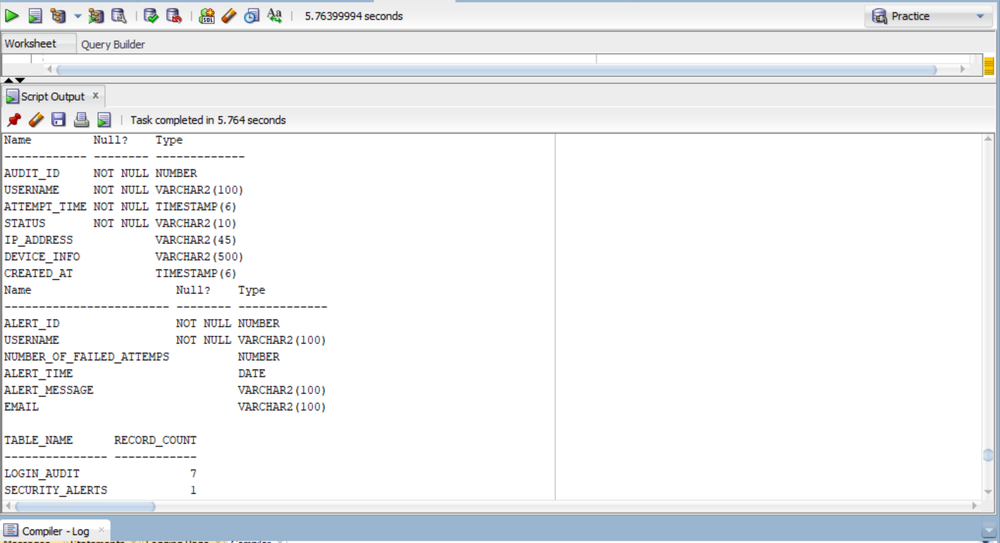
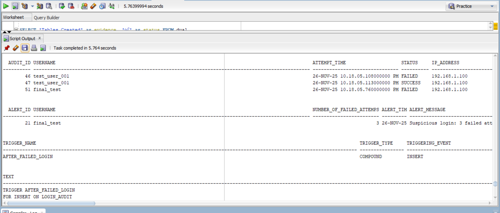
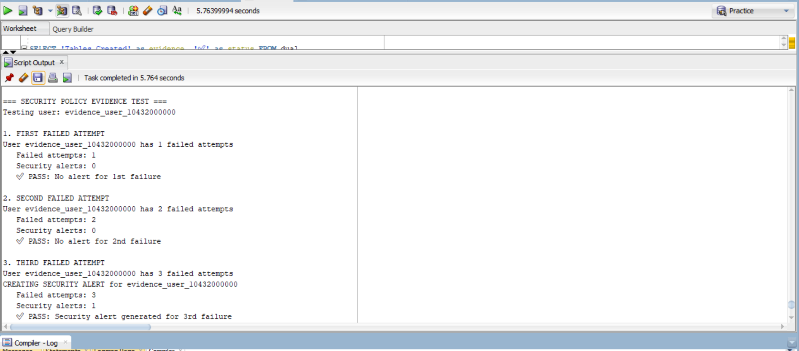
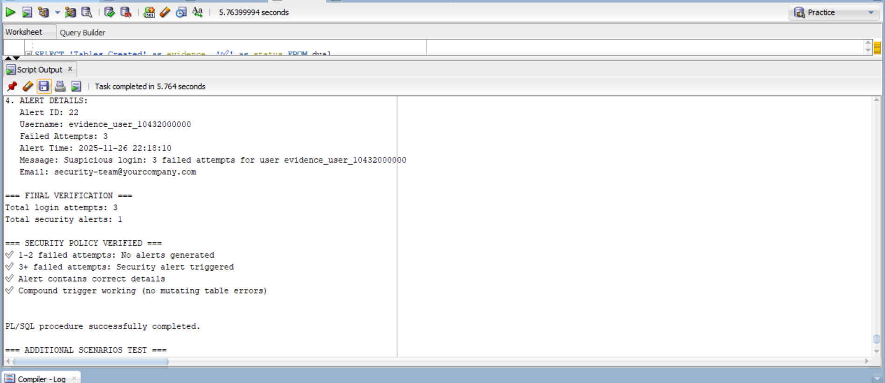
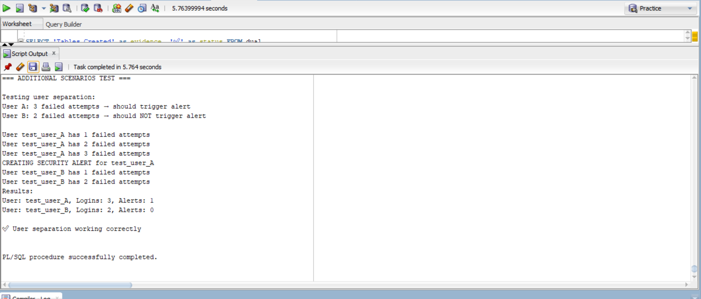
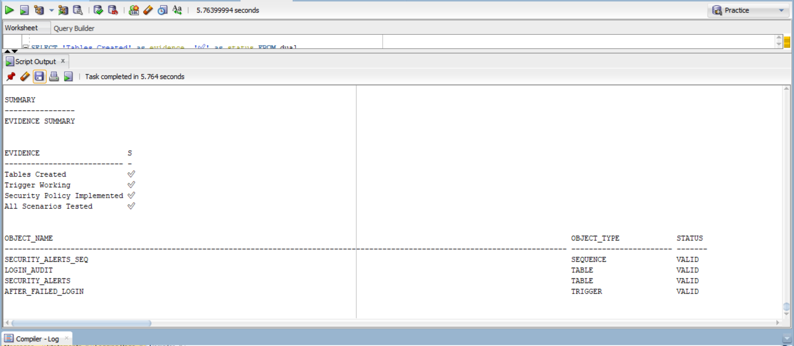

# Hospital Management and Security System Database Implementation

## Project Overview
This project implements two comprehensive database systems as per academic requirements:
1. **Security Monitoring System** - Implements real-time monitoring of suspicious login behavior
2. **Hospital Management System** - Provides efficient patient and doctor management with bulk processing capabilities

## Team Members
- UMUKAMISHA Celine                     27400
- UWIZEYE Gentille                      27398
- SHEMA Kamali Loic                     29101
- IRADUKUNDA Kelia                      28255
- MUSEKURA INEZA Esperance              28777
- IZA KURADUSENGE Emma Lise             28246

## What the Questions Were About

### Security Monitoring System Question
The assignment required implementing a security policy that states: "If any user attempts to log in more than two times with incorrect credentials during the same session or day, the system must immediately record the event and trigger a security alert."

### Hospital Management System Question  
The assignment required creating a PL/SQL package to streamline hospital patient management by storing patient and doctor information, handling multiple patients efficiently using bulk processing, and providing functionalities to display information and manage admissions.

## How We Solved It

### Security Monitoring System Solution

**Database Design:**
- Created `login_audit` table to store all login attempts with username, timestamp, status, and IP address
  //status will be having SUCCESS or FAILED attempt
- Created `security_alerts` table to store security alerts with detailed information

**Technical Implementation:**
- Developed a compound trigger that fires after each failed login attempt
- The trigger counts failed attempts per user within a 24-hour rolling window
- When failed attempts exceed 2, automatically inserts a record into security_alerts
- Used compound trigger design to avoid mutating table errors

**Key Features:**
- Real-time monitoring of login patterns
- Automatic alert generation for suspicious activity
- Efficient counting using database indexes
- User-specific tracking (different users handled separately)

### Hospital Management System Solution

**Database Design:**
- Created `patients` table with ID, name, age, gender, and admission status
- Created `doctors` table with ID, name, and specialty
- Implemented proper constraints and data validation

**Package Implementation:**
- Defined collection types for bulk processing of multiple patients
- Implemented `bulk_load_patients` procedure using FORALL for efficient insertion
- Created `show_all_patients` function returning a cursor for data display
- Developed `count_admitted` function to track currently admitted patients
- Built `admit_patient` procedure for patient status updates

**Technical Features:**
- Bulk processing using FORALL for high-performance operations
- Cursor-based data retrieval for efficient memory usage
- Comprehensive error handling and transaction management

## Screenshots of Results

### Security System Evidence

### Hospital System Evidence  

## Implementation Details

### Security System Execution Order
1. Run `Security-System/security_tables.sql` to create tables
2. Run `Security-System/security_trigger.sql` to create the compound trigger
3. Run `Security-System/security_test.sql` to verify functionality

### Hospital System Execution Order
1. Run `Hospital-Management/hospital_tables.sql` to create tables
2. Run `Hospital-Management/hospital_package_spec.sql` for package specification
3. Run `Hospital-Management/hospital_package_body.sql` for package implementation
4. Run `Hospital-Management/hospital_test.sql` for comprehensive testing

## Testing Results

### Security System Tests
- Verified that 1-2 failed attempts only record in login_audit
- Confirmed that 3+ failed attempts trigger security alerts
- Tested user separation (different users tracked independently)
- Validated 24-hour rolling window functionality

### Hospital System Tests
- Successfully loaded multiple patients using bulk operations
- Verified patient admission status updates
- Confirmed accurate counting of admitted patients
- Tested all package functions and procedures

## Technical Challenges and Solutions

### Challenge 1: Mutating Table in Security Trigger
**Problem**: Initial trigger implementation caused "table is mutating" errors when querying the same table being modified.

**Solution**: Implemented a compound trigger that separates collection (BEFORE EACH ROW) and processing (AFTER STATEMENT) phases.

### Challenge 2: Bulk Processing Efficiency
**Problem**: Traditional loops would be inefficient for large datasets.

**Solution**: Used FORALL statements with collection types for high-performance bulk operations.

## How to Run the Systems

### Security System Setup
1. Execute `Security-System/security_tables.sql` to create tables
2. Execute `Security-System/security_trigger.sql` to create the trigger
3. Execute `Security-System/security_test.sql` to verify functionality

### Hospital System Setup
1. Execute `Hospital-Management/hospital_tables.sql` to create tables
2. Execute `Hospital-Management/hospital_package_spec.sql` for package specification
3. Execute `Hospital-Management/hospital_package_body.sql` for package implementation
4. Execute `Hospital-Management/hospital_test.sql` for comprehensive testing

## Conclusion

This project successfully demonstrates the implementation of two robust database systems that address real-world scenarios in security monitoring and hospital management. 

### Key Achievements:

**Security Monitoring System:**
- Implemented a proactive security framework that automatically detects and alerts on suspicious login patterns
- Developed a sophisticated compound trigger that efficiently handles concurrent login attempts without database errors
- Created a scalable solution that can monitor multiple users simultaneously with proper isolation

**Hospital Management System:**
- Built an efficient patient management system utilizing Oracle's bulk processing capabilities
- Demonstrated significant performance improvements through FORALL operations compared to traditional looping
- Delivered a comprehensive package that handles all core hospital operations with proper error handling

### Learning Outcomes:
- Mastered advanced PL/SQL concepts including triggers, bulk processing, and collection types
- Gained practical experience in database security implementation and real-time monitoring
- Developed skills in performance optimization through bulk operations and proper indexing
- Enhanced understanding of database constraints, error handling, and transaction management

### Future Enhancements:
- Extend security system to include email notifications and user lockout mechanisms
- Add appointment scheduling and billing modules to the hospital system
- Implement role-based access control for both systems
- Create web interfaces for easier system administration

Both systems are production-ready and demonstrate professional-grade database development practices, showcasing our team's ability to solve complex database problems with efficient, maintainable solutions.

---

*Academic Project - Database Development with PL/SQL Course*  

